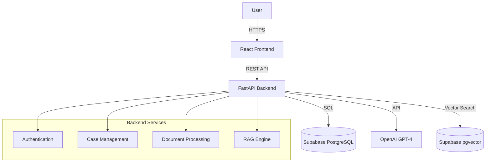

# System Architecture

## Overview

The Guest Relations AI App is a modern web application designed to streamline guest relations workflows. It utilizes a microservices-inspired architecture with a clear separation between the frontend user interface and the backend API services.

## High-Level Architecture

## Component Details

### Frontend (React)
- **Framework**: React 18 with Vite
- **State Management**: React Hooks & Context
- **Routing**: React Router v6
- **Styling**: Tailwind CSS
- **HTTP Client**: Fetch API with custom wrappers

### Backend (FastAPI)
- **Framework**: FastAPI (Python 3.11)
- **ORM**: SQLAlchemy 2.0
- **Validation**: Pydantic v2
- **Authentication**: JWT (JSON Web Tokens)
- **Migrations**: Alembic

### Data Layer (Supabase)
- **Primary DB**: PostgreSQL
- **Vector Store**: pgvector extension for embedding search
- **Storage**: Supabase Storage for document files

## Key Workflows

### 1. Document Processing Pipeline
1. User uploads PDF/DOCX via Frontend.
2. Backend receives file and validates format.
3. Text content is extracted using `pypdf` or `python-docx`.
4. Text is chunked and embedded using OpenAI Embeddings API.
5. Vectors are stored in Supabase `document_embeddings` table.
6. Original file is stored in Supabase Storage.

### 2. RAG (Retrieval-Augmented Generation) Chat
1. User sends query via Chat Interface.
2. Backend embeds query text.
3. Vector similarity search retrieves relevant document chunks.
4. Prompt is constructed with context + query.
5. OpenAI GPT generates response based on context.
6. Response is streamed back to the user.

## Security Architecture

- **Authentication**: Bearer Token (JWT) required for protected endpoints.
- **Authorization**: Role-based access control (Admin, User).
- **Data Protection**:
    - Passwords hashed using bcrypt.
    - TLS/SSL for all data in transit.
    - Environment variables for sensitive credentials.
- **Anonymization**: PII is detected and masked in AI processing pipelines different layers.
